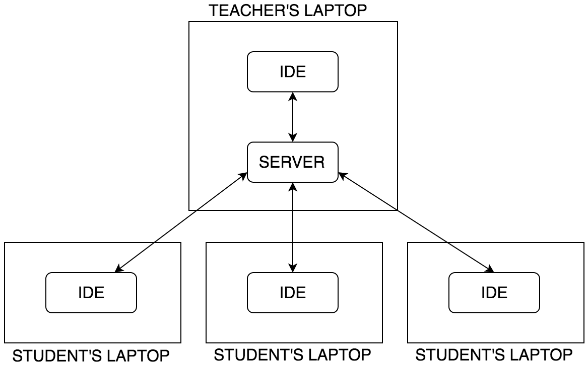

Code4Brownies is a  software that enables instructors and students share codes (using the [Sublime Text](https://www.sublimetext.com/3) editor) instantaneously during a lecture or study session.  Code4Brownies is minimal as it is designed to stay out of the way while providing the necessary features for collaborative coding.
Traditionally, coding is a very lonely process; it's hard to get instant feedbacks from others.  Pair programming was found to be helpful.  Current computational thinking practices encourage communication and collaboration during the problem solving process.  This is why Code4Brownies was created.

Code sharing is achieved through Sublime Text editors on students' and teacher's laptop talking to each other through a server run on the teacher's laptop.

## Basic Workflow

+ Instructor runs the server on his/her laptop in class. The server provides the IP address.

+ Students and instructor set the IP address in Sublime Text 3 (ST3).

+ To share codes in a current ST3 window, instructor selects "Broadcast" on the ST3 menu.  To get the instructor's broadcast content, a student selects "Whiteboard" on the ST3 menu.

+ To share codes in a current ST3 window, a student selects "Share" on the ST3 menu.  Instructor gets codes from students by selecting "Get All" on the ST3 menu.

+ Instructor can give a brownie point to a student based on his/her submission.

+ When instructor terminates the server, brownie points are saved to a local file.

## Installation

Click [HERE](INSTALL).

